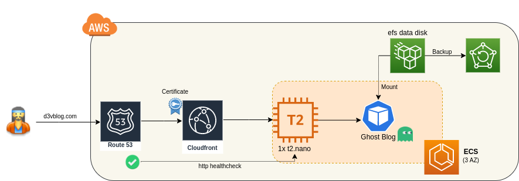

# My old Ghost blog on aws

## Overview

### Scope
- I need to keep my old ghost blog running. 
- My version of ghost is too old to be upgraded and I don't want to spend time re-develop a static site.
- I did not find any nice gatsby/hugo templates.
- I will use the smallest EC2 instance (2$/months), ECS/ASG (free), and a cloudfront (cheap) to keep the site up. 
- However, it is not 100% HA, need to link manually the DNS to cloudfront if the instance get destroyed. If so a healthcheck will alert me to relaunch the terraform plan with the new instance DNS.

### Tech
- Hosting: AWS cloud
- Front: Ghost in docker (version 0.11.3, newer makes my blog fail)
- Container orchestrator: ECS (1 EC2 instance t2.nano)
- Data: EFS + daily backup
- CDN: Cloudfront + Cert
- Code: Github
- Infra: Terraform cloud
- Price: < 3$ / month

### Flow
User --> Route53 --> Cloudfront --> EC2 DNS (docker ghost on ECS) <-- EFS (blog data)

## Infra


### Prerequisit
- Purchase domain `d3vblog.com` in route53
- Create custom certificate in zone `us-east-1` (for cloudfront to see)

### Terraform
- Deploy with:
```
cd terraform/dev
nano main.tf    <-- edit variables
terraform init  
terraform apply
```
- If using terraform cloud: change workspace -> setting to "local" (to use your local aws credential)
- First deploy should not work because the blog data are not in EFS.

#### Fix the data
- Delete the ECS service ghost
- Connect to the EC2 instances, mount the EFS volume (check its DNS name in the console):
```
sudo mkdir /mnt/efs
sudo mount -t efs fs-9921c253.efs.eu-west-1.amazonaws.com /mnt/efs/
```
- And copy the data from a backup to `/mnt/efs/.` ex: `scp -r -i ~/.ssh/aws-greg-eu-west-1.pem ~/Documents/blog/blog-data  ec2-user@54.194.140.51:~/`

#### Fix CloudFront -> EC2 (ECS) link
- There are no LB because of cost (20$ per month). So if instance goes down, I have to update cloudfront origin with the EC2 instance public DNS.
- Get the DNS of the ECS instance and replace the variable `instance_dns` in `terraform/dev/main.tf`
- Run again a `terraform deploy`

### Check
- Try the website on instance and CloudFront url
- Try with your DNS: https://d3vblog.com

### Backup
- Use [backup](https://eu-west-1.console.aws.amazon.com/backup) to backup every day your EFS data.

### Setup SNS for delivering monitoring alert
- Terraform will not let you create a subcription to SNS, so you are alerted when the blog goes down.
- You have to go via the console to SNS, region `us-east-1`(!), create an EMAIL subscription, and validated the url in your mailbox.

### Lower the cost
- Go the EC2/reserved instance and buy a linux `t2.nano` in the region your deployed the ECS cluster. Insted of paying 5$/month for a `t2.nano` your should be able to find some 2.2$ / month
- Domain purchase should be around 10$ / month

Maintenance cost of this infra / month:
- 1 EC2 instance: 2.2$ for converible reserved (5$ for on demand)
- 1 heathcheck: 0.5$ ($0.50* per health check / month)
- Efs disk (< 50MB): < 0.02$ ($0.33 /GB/month)
- Efs backup: ~0$ ($0.06 per GB-Month)
- ECS: free
- **Total ~ 3$ / month**

## Annexes
- To run manually the container: `docker run -d -p 2368:2368 -e NODE_ENV=production --name ghost -v $PWD/ghost-backup:/var/lib/ghost ghost:0.11.3`
- Check that blog data are present, and the rights are set

# Todo
- Healtcheck alarm issue 